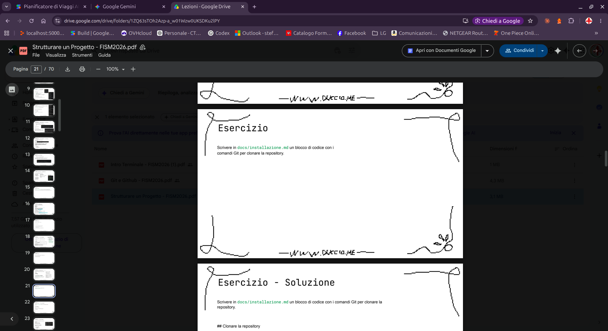

### Clonare la repository

Per scaricare una copia locale del progetto sul tuo computer, apri il terminale e segui questi passaggi:

1. Naviga nella cartella in cui desideri salvare il progetto.
2. Esegui il comando di clonazione:


``` bash
git clone https://github.com/tuo-username/nome-repository.git
cd nome-repository
```



### 📋 Check-list dei passi completati

Sposta il terminale nella tua cartella e segui i passaggi. Puoi spuntare le caselle man mano che procedi:

- [x] **Passo 1:** Verificare la versione di Git (`git --version`)
- [ ] **Passo 2:** Posizionarsi nella cartella corretta (`cd ~/Documents`)
- [ ] **Passo 3:** Clonare il progetto (`git clone <url>`)
- [ ] **Passo 4:** Entrare nella cartella del progetto (`cd nome-repository`)
- [ ] **Passo 5:** Verificare lo stato con `git status`
